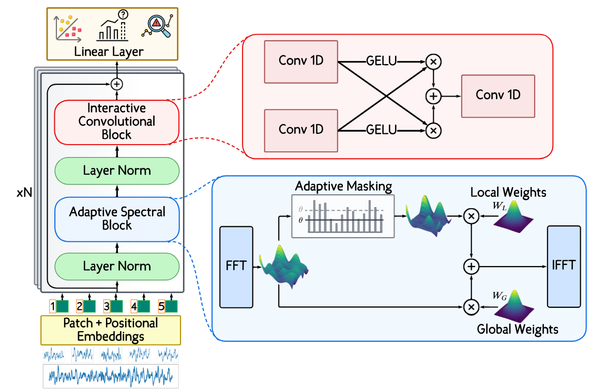

# TSLANet: Rethinking Transformers for Time Series Representation Learning [[Paper](https://arxiv.org/pdf/2404.08472.pdf)] [[Cite](#citation)]
#### *by: Emadeldeen Eldele, Mohamed Ragab, Zhenghua Chen, Min Wu,and Xiaoli Li*

### This work is accepted in ICML 2024!

## Abstract
<p align="center">

</p>

Time series data, characterized by its intrinsic long and short-range dependencies, poses a unique challenge across analytical applications. While Transformer-based models excel at capturing long-range dependencies, they face limitations in noise sensitivity, computational efficiency, and overfitting with smaller datasets. In response, we introduce a novel <b>T</b>ime <b>S</b>eries <b>L</b>ightweight <b>A</b>daptive <b>Net</b>work (<b>TSLANet</b>), as a universal convolutional model for diverse time series tasks. Specifically, we propose an Adaptive Spectral Block, harnessing Fourier analysis to enhance feature representation and to capture both long-term and short-term interactions while mitigating noise via adaptive thresholding. Additionally, we introduce an Interactive Convolution Block and leverage self-supervised learning to refine the capacity of TSLANet for decoding complex temporal patterns and improve its robustness on different datasets. Our comprehensive experiments demonstrate that TSLANet outperforms state-of-the-art models in various tasks spanning classification, forecasting, and anomaly detection, showcasing its resilience and adaptability across a spectrum of noise levels and data sizes.


## Datasets
### Forecasting
Forecasting and AD datasets are downloaded from TimesNet https://github.com/thuml/Time-Series-Library

### Classification
- UCR and UEA classification datasets are available at https://www.timeseriesclassification.com
- Sleep-EDF and UCIHAR datasets are from https://github.com/emadeldeen24/TS-TCC
- For any other dataset, to convert to `.pt` format, follow the preprocessing steps here https://github.com/emadeldeen24/TS-TCC/tree/main/data_preprocessing


## Citation
If you found this work useful for you, please consider citing it.
```
@inproceedings{tslanet,
  title     = {TSLANet: Rethinking Transformers for Time Series Representation Learning},
  author    = {Eldele, Emadeldeen and Ragab, Mohamed and Chen, Zhenghua and Wu, Min and Li, Xiaoli},
  booktitle = {International Conference on Machine Learning},
  year      = {2024},
}
```

## Acknowledgements
The codes in this repository are inspired by the following:

- GFNet https://github.com/raoyongming/GFNet
- Masking task is from PatchTST https://github.com/yuqinie98/PatchTST
- Forecasting and AD datasets are downloaded from TimesNet https://github.com/thuml/Time-Series-Library
